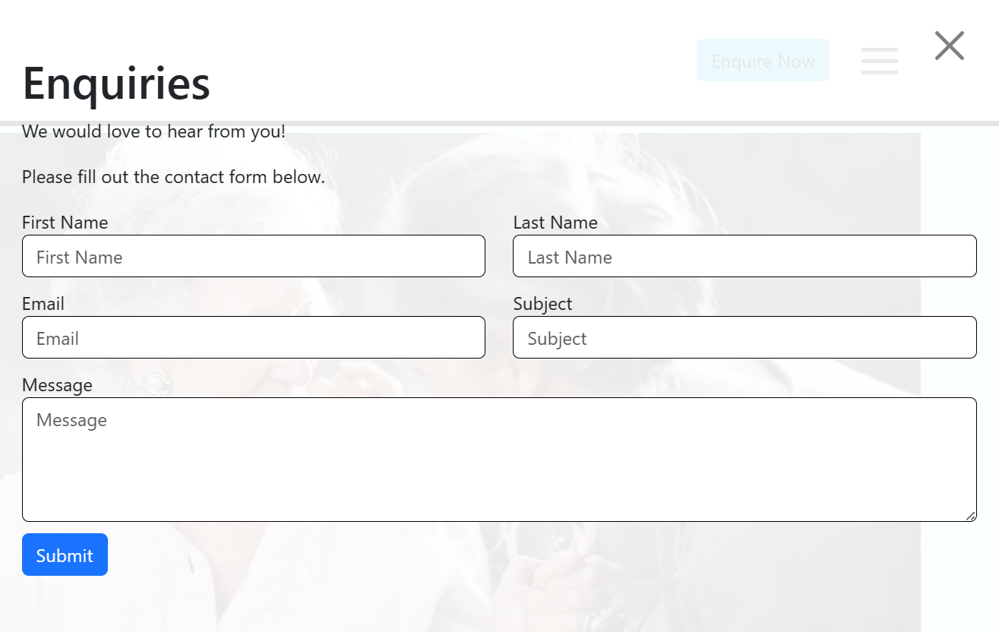
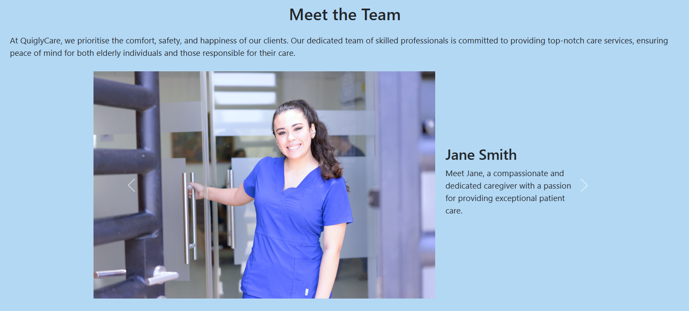

# QuiglyCare

QuiglyCare is a dynamic care service application that allows users to learn more about the services of QuiglyCare and quickly book appointments.

## Description

QuiglyCare is a user-friendly web application designed to offer seamless access to a range of dedicated care services. Upon entering the home page, users can easily navigate through the navigation bar, which provides direct links to different sections of the website.

Additional sections include:

- Meet the Team — which provides insights into each team member including names, roles, brief descriptions and photos to allow users to connect with the team on a personal level.

- FAQs — where users will find clear and concise instructions on utilising the booking feature, along with step-by-step guidance and essential details to facilitate a smooth booking process.

- Services — which provides detailed information on the types of care available, pricing details, and any special offerings or packages.

Planned future sections include:

Calendar section — For those seeking drop-in care appointments, the Calendar section displays the availability of QuiglyCare team members and is integrated with the team's Google Calendar. This allows users to effortlessly schedule appointments. 

Upon submitting a booking, users receive a confirmation email with appointment details and a notification is sent to the relevant person, ensuring efficient communication.

### User Story 

- As a user looking for drop-in care service,
- I want to easily access information about QuiglyCare's services,
- So that I can learn more about the team, understand the booking process 
through an FAQ section, and efficiently book appointments with the team 
members.

## Images of Deployed Site

Navbar - 


Enquiry Form - 



About Us - 


Services - 


Meet the Team - 



FAQs - 


Footer -


## Technologies

QuiglyCare is built using React.js (version 18.2.0), a popular JavaScript library for building user interfaces.

The site also uses React UI Components, including: 
- React Bootstrap
- React Smooth Scrolling
- React Carousel
- React Burger Menu

QuiglyCare utilises the Web3Forms API to add functionality to the applications enquiry form. This API allows confirmation emails to be sent when to the user when they submit a form and also sends a notification email to the intended recipient. 

- Documentation on the Web3Forms API can be found <a href="https://docs.web3forms.com/">here</a>.
- A new Web3Forms access key can be created <a href="https://web3forms.com/#start">here</a>.

The Google Calendar API will be utilised in the future to sync the QuiglyCare application calendar with the calendars of care staff. This will enable available appointments to show for users visiting the site.

- Documentation for the Google Calendar API can be found <a href="https://developers.google.com/calendar/api/guides/overview">here</a>.

## Getting Started

To run QuiglyCare locally, follow these steps:

### Prerequisites

Ensure you have the following installed on your machine:

- Node.js (https://nodejs.org/)
- npm (https://www.npmjs.com/)


### Installation

1. Clone the repository to your local machine:

```git clone https://github.com/your-username/quiglycare.git```

2. Navigate to the project directory:

```cd QuiglyCare```

3. Install the project dependencies via terminal:

```npm install``` <br>
```npm install bootstrap react-bootstrap``` <br>
```npm install react-responsive-carousel``` <br>
```npm install react-burger-menu```<br>
```npm install react-scroll```

### Running Locally

4. Start the development server:

```npm run dev```

This will launch the application locally, which you can access via the 'localhost' link in your terminal.

### Deployment 

QuiglyCare is automatically deployed using Netlify. Any changes pushed to the 'main' branch will trigger a new deployment.

You can visit the deployed site <a href="https://main--quiglycare.netlify.app/">here</a>.

## Usage

Once QuiglyCare is deployed, no other configuration is required.

## Contributing

We welcome contributions! If you'd like to contribute to QuiglyCare, please reach out to a member of the team via the GitHub details at the bottom of this page.

## License

MIT License

## Credits

- Ewelina Sobora: <a href="https://github.com/ewelinasobora">Github</a>
- Lucy Bonfield: <a href="https://github.com/lucybonfield">Github</a>
- Dominic Brown: <a href="https://github.com/dombrown95">Github</a>

## React + Vite

This template provides a minimal setup to get React working in Vite with HMR and some ESLint rules.

Currently, two official plugins are available:

- [@vitejs/plugin-react](https://github.com/vitejs/vite-plugin-react/blob/main/packages/plugin-react/README.md) uses [Babel](https://babeljs.io/) for Fast Refresh
- [@vitejs/plugin-react-swc](https://github.com/vitejs/vite-plugin-react-swc) uses [SWC](https://swc.rs/) for Fast Refresh
